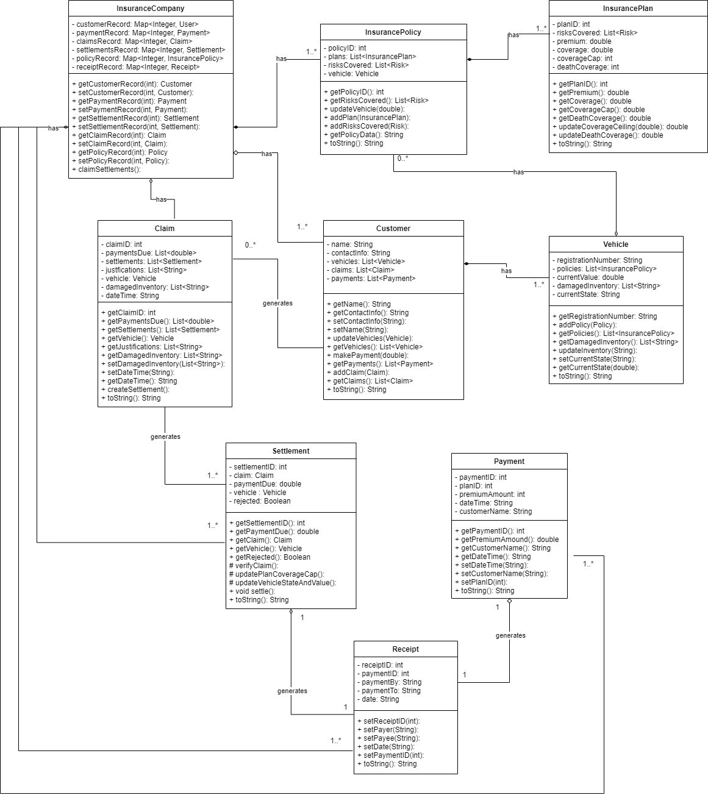

# Vehicle Insurance Company implementation in JAVA.

## File Structure:
- src:
  - VehicleInsurance
    - source .java files
- test:
  - VehicleInsurance
    - test .java files

## Main File:
- src/VehicleInsurance/InsuranceCompany.java
- Run the above file and the prompts will direct the rest of the implementation. 

## MVC:
- This project uses the MVC design principle.
- View: A simple class to show the basic interface and print outputs/prompts to screen.
- Model: Each entity from the design has a separate class to promote Single Task design principle.
- Controller: A basic controller using Command Design Pattern to improve the separation between tasks.

## Design:
